# 🌌 VertexFlow - Interactive 3D Developer Portfolio

[](https://vertex-flow-phi.vercel.app)
[](https://react.dev/)
[](https://threejs.org/)
[](https://gsap.com/)


Welcome to the source code for my personal developer portfolio, **VertexFlow**. This project is a highly interactive, 3D-powered web experience designed to showcase my journey as a Full-Stack and AI/ML Developer. 

🔗 **[View Live Portfolio](https://vertex-flow-phi.vercel.app/)**
---
## 📱 Visual Experience

VertexFlow is engineered to bridge the gap between high-end 3D graphics and functional web interfaces. The experience is centered around fluid motion and depth.

<div align="center">
  <table style="width:100%; text-align:center;">
    <tr>
      <td width="50%">
        <p align="center"><b>🌌 Immersive Hero Scene</b></p>
        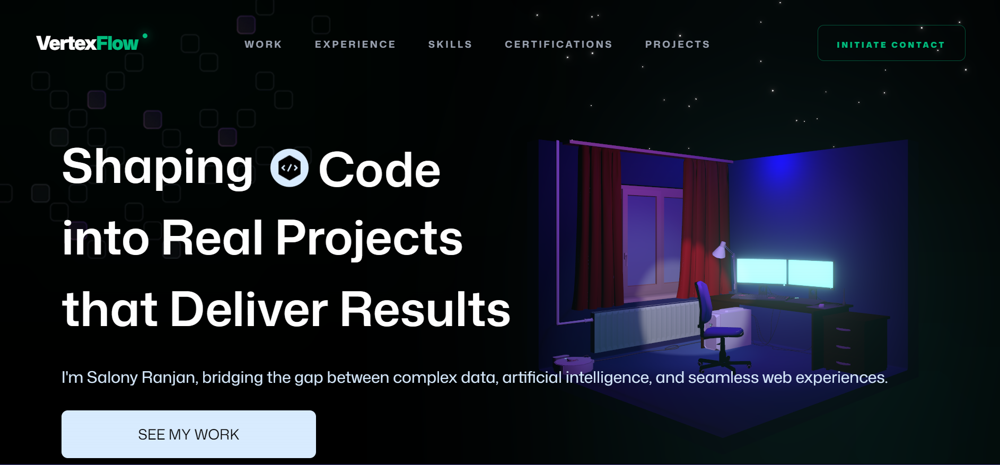
        <p><i>Real-time WebGL environment built with Three.js and custom shaders.</i></p>
      </td>
      <td width="50%">
        <p align="center"><b>🚀 Project Showcase</b></p>
        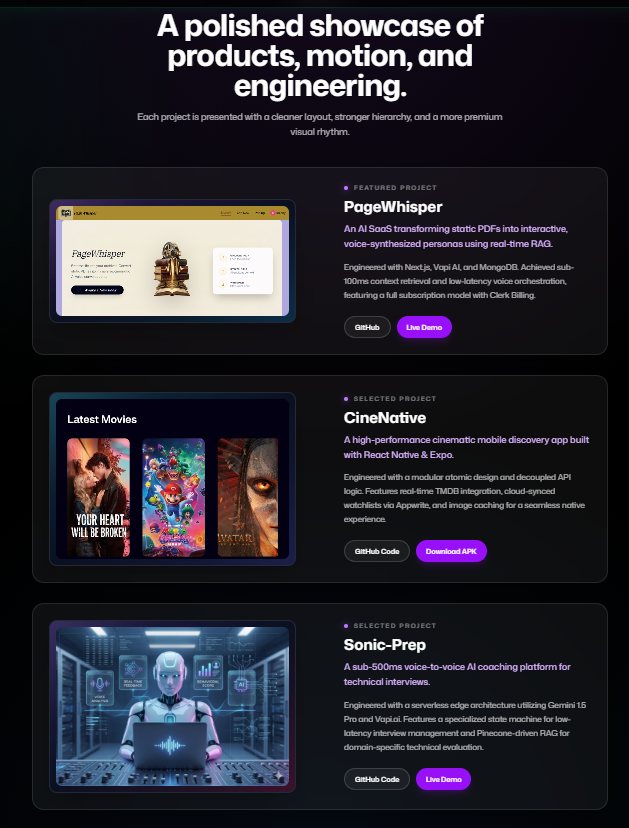
        <p><i>Interactive 3D cards with hover-responsive tilt and parallax effects.</i></p>
      </td>
    </tr>
    <tr>
      <td width="50%">
        <p align="center"><b>🛠️ Tech Stack Visualization</b></p>
        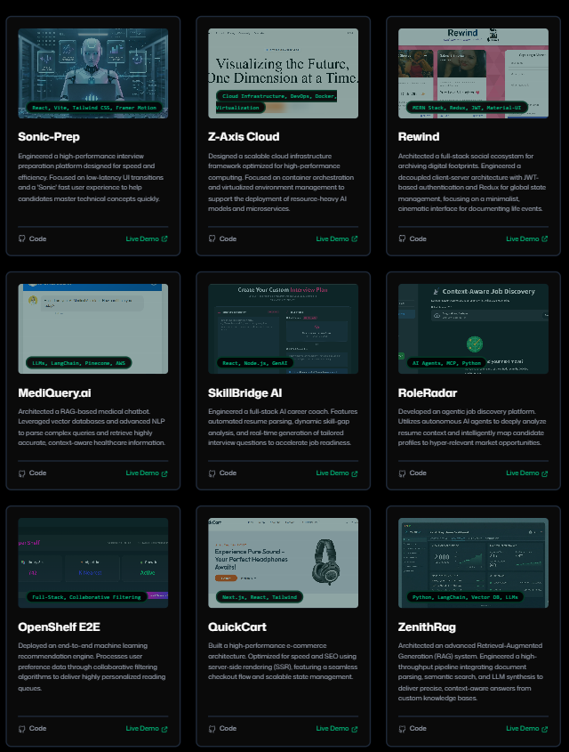
        <p><i>GSAP-orchestrated timelines revealing technical proficiency on scroll.</i></p>
      </td>
      <td width="50%">
        <p align="center"><b>✉️ Cinematic Contact</b></p>
        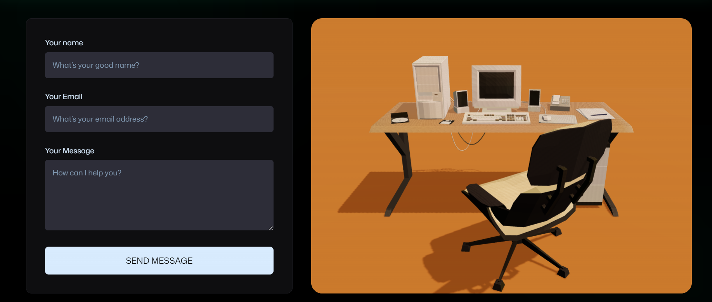
        <p><i>Glassmorphic UI design optimized for high-conversion and sleek interaction.</i></p>
      </td>
    </tr>
  </table>

  <br />
  <i>"VertexFlow leverages React Three Fiber and GSAP to deliver a silky-smooth 60 FPS experience that adapts seamlessly across all device tiers."</i>
</div>

---

### 🎨 Design Highlights
* **Glassmorphic UI:** Utilizing backdrop blurs and semi-transparent layers for a modern, futuristic feel.
* **Motion Blur & Bloom:** Custom post-processing effects to enhance the cinematic quality of 3D renders.
* **Responsive Camera:** Dynamically adjusted Field of View (FOV) to ensure the 3D scene looks perfect on both mobile and ultra-wide displays.
---
## ✨ Key Features

VertexFlow isn't just a portfolio; it's a high-performance 3D engine designed to showcase technical depth through immersive storytelling.

### 🎭 Cinematic 3D Experience
* **Immersive Environments:** Built with **Three.js** and **React Three Fiber (R3F)** for high-fidelity WebGL rendering.
* **Dynamic Geometry:** Optimized 3D model orchestration with **@react-three/drei**, ensuring fast load times without sacrificing visual quality.

### 🌊 Fluid Motion & Orchestration
* **Smooth Scroll Physics:** Integrated **Lenis** smooth-scrolling to eliminate "scroll jank" and provide a native-app feel.
* **Scroll-Triggered Timelines:** Complex animation sequences orchestrated via **GSAP (GreenSock)** that stay perfectly in sync with user movement.
* **UI Micro-interactions:** Declarative, spring-based animations using **Framer Motion** for polished interface feedback.

### ⚡ Modern Engineering Stack
* **Next-Gen Tooling:** Built on **Vite** and **React 19** for near-instant Hot Module Replacement (HMR).
* **Utility-First Styling:** Leveraging **Tailwind CSS v4** for a streamlined, high-performance design system.
* **Serverless Connectivity:** A robust contact system powered by **EmailJS** for seamless client-side communication.
---
## 🏗️ Feature Orchestration Architecture
The following diagram illustrates how the technical components of VertexFlow interact to create the "Cinematic Flow":

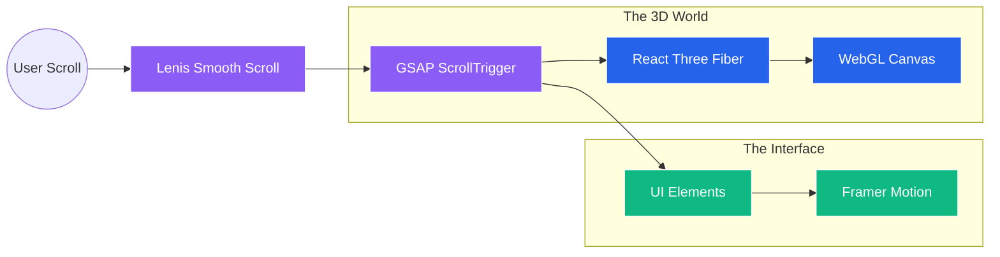
---
## 🏗️ Architecture & Interaction Flow
### 1. The Interaction Flow (Mermaid)

This diagram shows how the user interacts with the 3D layer versus the UI layer.
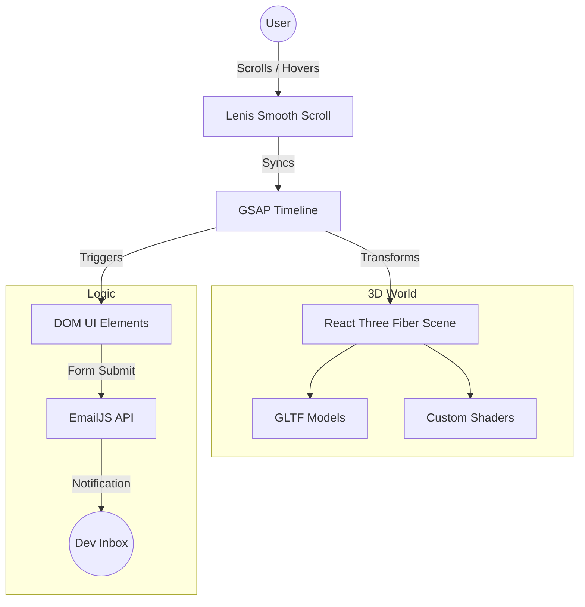
### 2. Technical Stack Hierarchy
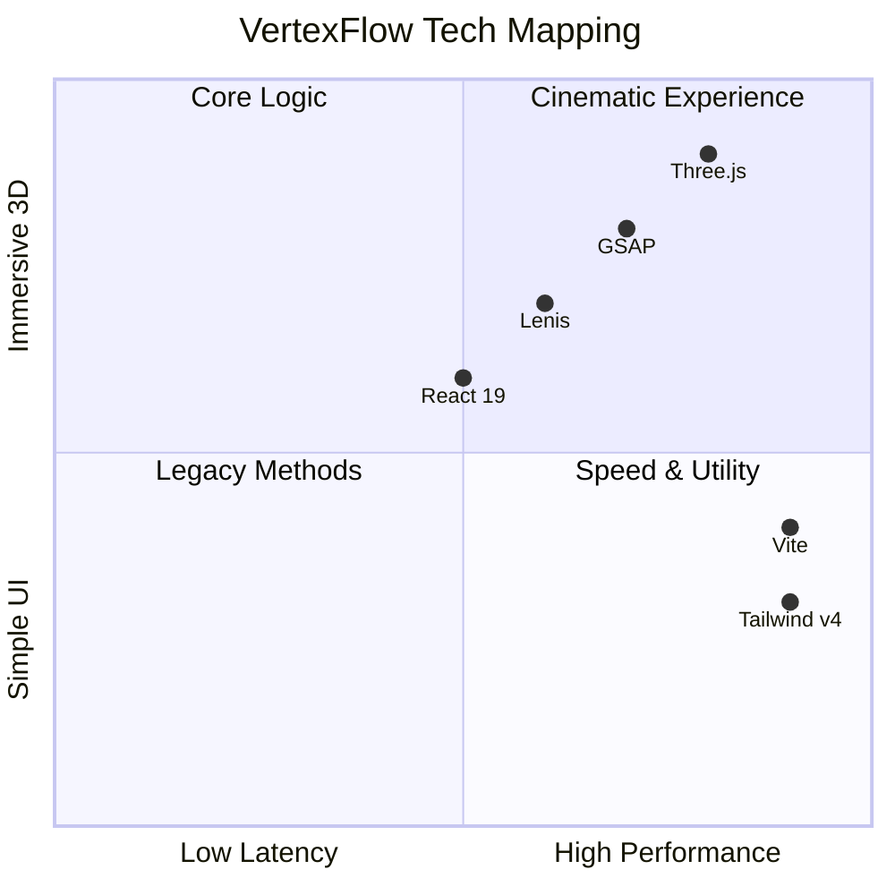
### 3. Feature Relationship (ERD Style)
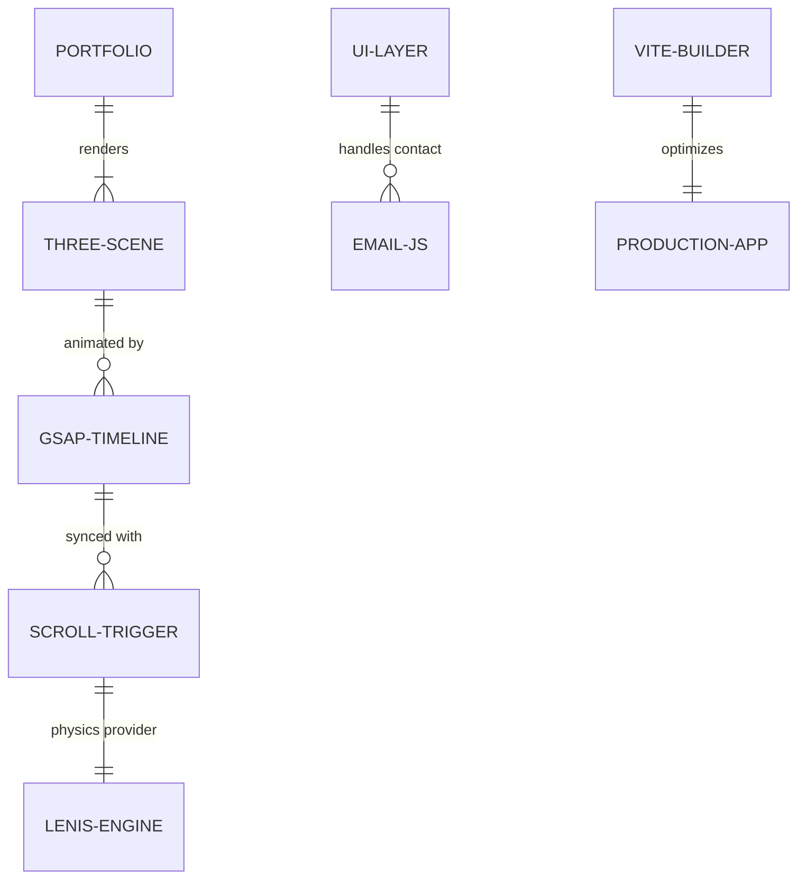
### 🗄️ Conceptual Data Model (ER Diagram)

Although VertexFlow is a serverless frontend application, the UI is driven by a strictly typed data model structure, and user interactions are handled via structured payloads to external APIs.

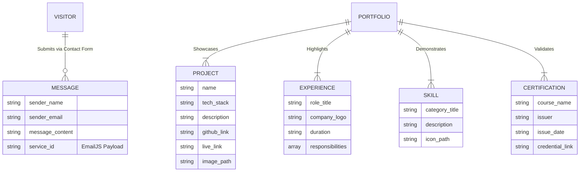
---

## 🛠️ Tech Stack

VertexFlow is built with a modern, performance-first stack, focusing on the intersection of 3D graphics and scalable web architecture.

### 🎨 3D & Creative Engineering
| Technology | Usage |
| :--- | :--- |
| **Three.js** | Core WebGL engine for 3D rendering |
| **React Three Fiber** | Declarative Three.js for the React ecosystem |
| **GSAP** | Professional-grade animation timelines and scroll orchestration |
| **Framer Motion** | Declarative UI transitions and micro-interactions |
| **Lenis** | High-performance smooth scroll engine |

### 🏗️ Frontend & Styling
* **React 19:** Utilizing the latest concurrent rendering features.
* **Vite:** Next-generation frontend tooling for ultra-fast HMR.
* **Tailwind CSS v4:** Utility-first styling with the latest CSS engine capabilities.
* **Lucide React:** Clean, consistent vector iconography.

### 🔌 Integrations & DevOps
* **EmailJS:** Serverless client-side email integration for the contact system.
* **Vercel:** Globally distributed edge deployment and CI/CD.
* **Git/GitHub:** Version control and source management.

---

### 📡 System Architecture Overview

This diagram represents the data and animation flow within VertexFlow:

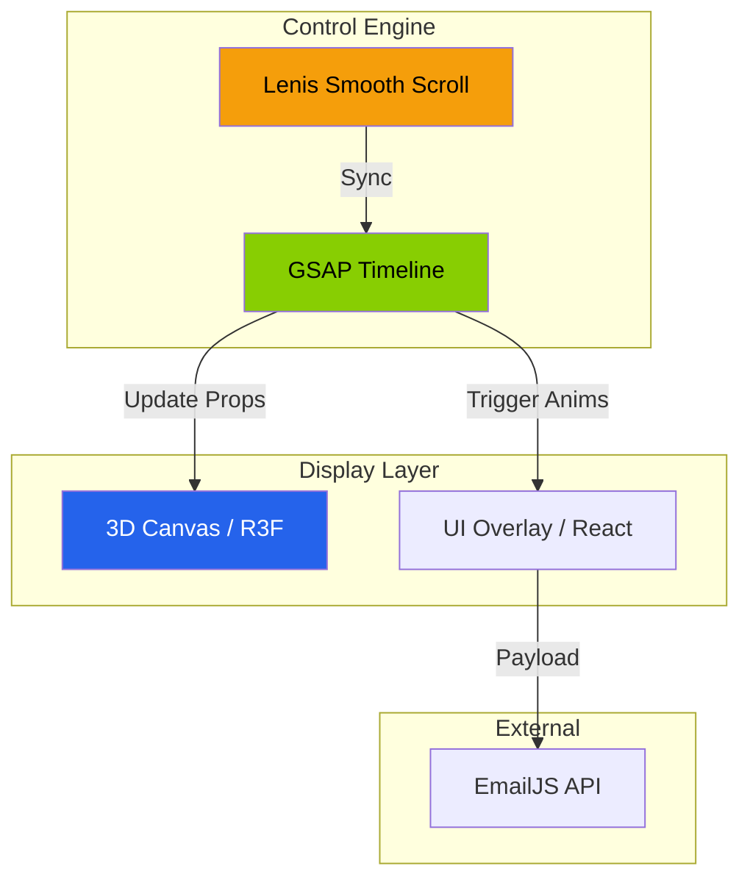
---
## 🚀 Featured Engineering Projects

VertexFlow serves as the immersive gateway to my technical work, highlighting expertise across AI/ML, Full-Stack Development, and Cloud Infrastructure.

### 🧠 AI & Agentic Systems
* **[ZenithRAG](https://github.com/salonyranjan/ZenithRAG)** | `Python` `LangChain` `Vector DB` `LLMs`
  * Architected an advanced Level-3 RAG system with a high-throughput pipeline for document parsing and semantic synthesis.
* **[RoleRadar](https://github.com/salonyranjan/RoleRadar)** | `AI Agents` `MCP` `Python`
  * Developed an agentic job discovery platform using autonomous AI agents to map profiles to hyper-relevant market opportunities.
* **[MediQuery.ai](https://github.com/salonyranjan/MediQuery.ai)** | `LLMs` `LangChain` `Pinecone` `AWS`
  * Built a RAG-based medical chatbot leveraging vector databases for context-aware healthcare information retrieval.

### 🌐 Full-Stack & Cloud
* **[Z-Axis Cloud](https://github.com/salonyranjan/Z-Axis-Cloud)** | `Docker` `Cloud Infra` `DevOps`
  * Designed a scalable cloud framework optimized for container orchestration and resource-heavy AI model deployment.
* **[SkillBridge AI](https://github.com/salonyranjan/SkillBridge-AI)** | `React` `Node.js` `GenAI`
  * Engineered an AI career coach featuring automated resume parsing and dynamic skill-gap analysis.
* **[Rewind](https://github.com/salonyranjan/Rewind)** | `MERN Stack` `Redux` `JWT`
  * Architected a social ecosystem for digital footprints with a decoupled client-server architecture and cinematic UI.

### ⚡ Performance & Scalability
* **[Sonic-Prep](https://github.com/salonyranjan/sonic-prep)** | `Vite` `Framer Motion` – High-performance interview prep platform focused on low-latency UI.
* **[QuickCart](https://github.com/salonyranjan/QuickCart)** | `Next.js` `SSR` `Tailwind` – E-commerce architecture optimized for SEO and speed.
* **[OpenShelf E2E](https://github.com/salonyranjan/OpenShelf-E2E)** | `ML` `Collaborative Filtering` – End-to-end recommendation engine for personalized content.

---

### 🛠️ Technical Domain Expertise
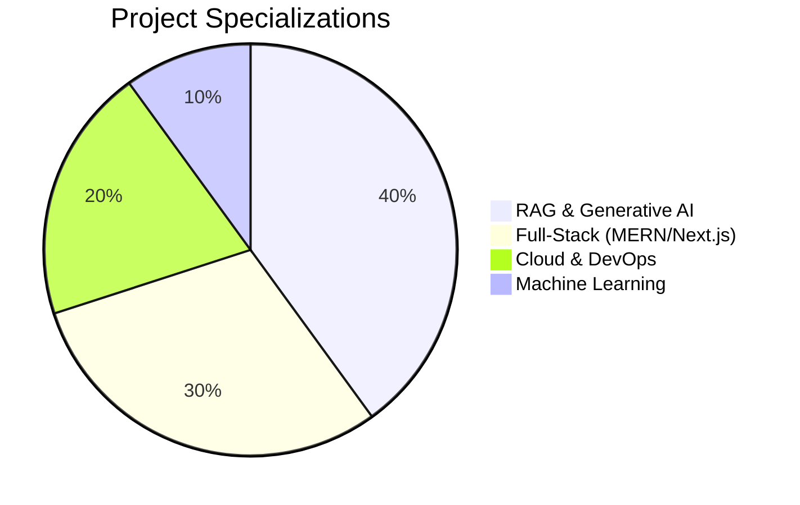
---

## 💻 Running Locally

Want to explore the code or run it on your own machine? Follow these steps:

### 1. Clone the repository
```bash
git clone [https://github.com/salonyranjan/VertexFlow.git](https://github.com/salonyranjan/VertexFlow.git)
cd VertexFlow
```
### 2. Install dependencies
```bash
npm install
```
### 3. Set up Environment Variables
To make the contact form work locally, create a .env file in the root directory and add your EmailJS credentials:
```
Code snippet
VITE_APP_EMAILJS_SERVICE_ID=your_service_id_here
VITE_APP_EMAILJS_TEMPLATE_ID=your_template_id_here
VITE_APP_EMAILJS_PUBLIC_KEY=your_public_key_here
```
### 4. Start the development server
```bash
npm run dev
```
The application will be available at http://localhost:5173.

---
## 🌐 Deployment
This project is configured for seamless deployment on Vercel.

**Framework Preset: Vite**

**Build Command: npm run build**

**Output Directory: dist**

Note: Ensure that Environment Variables are also configured in your Vercel Project Settings for the live contact form to function properly.

