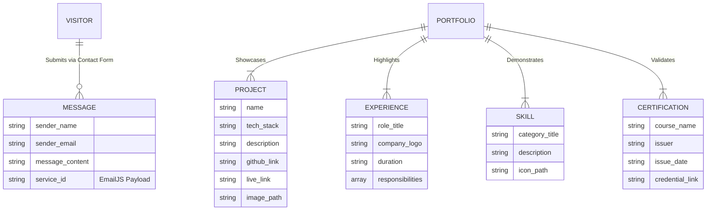

# 🌌 VertexFlow - Interactive 3D Developer Portfolio


Welcome to the source code for my personal developer portfolio, **VertexFlow**. This project is a highly interactive, 3D-powered web experience designed to showcase my journey as a Full-Stack and AI/ML Developer. 

🔗 **[View Live Portfolio](https://vertex-flow-3h66oz0m7-salonyranjans-projects.vercel.app)** ---

## ✨ Features

- **Interactive 3D Elements:** Immersive 3D models and environments built with Three.js and React Three Fiber.
- **Fluid Animations:** Complex scroll-triggered animations and page transitions powered by GSAP and Framer Motion.
- **Smooth Scrolling:** Silky smooth, physics-based scrolling utilizing Lenis.
- **Functional Contact Form:** Direct-to-email contact form integrated seamlessly with EmailJS.
- **Responsive Design:** Fully optimized for both desktop and mobile viewing experiences.
- **Modern Architecture:** Built on Vite for lightning-fast Hot Module Replacement (HMR) and optimized production builds.

## 🛠️ Tech Stack

### Frontend & Core
- **React 19** - UI Library
- **Vite** - Build Tool & Development Server
- **Tailwind CSS v4** - Utility-first styling

### 3D & Animation
- **Three.js** - WebGL 3D Engine
- **@react-three/fiber** - React renderer for Three.js
- **@react-three/drei** - Useful helpers for React Three Fiber
- **GSAP (GreenSock)** - Professional-grade animation library
- **Framer Motion** - Declarative animations for React
- **Lenis** - Smooth scroll API

### Utilities & Integrations
- **@emailjs/browser** - Client-side email integration

---
## 🗄️ Conceptual Data Model (ER Diagram)

Although VertexFlow is a serverless frontend application, the UI is driven by a strictly typed data model structure, and user interactions are handled via structured payloads to external APIs.



## 🚀 Projects Showcased

This portfolio highlights my top engineering projects, including:
- **MediQuery.ai:** RAG-based medical chatbot using LLMs, LangChain, and AWS.
- **SkillBridge AI:** Full-stack AI career coach with automated resume parsing.
- **RoleRadar:** Agentic job discovery platform using autonomous AI agents.
- **OpenShelf E2E:** Machine learning recommendation engine utilizing collaborative filtering.
- **QuickCart:** High-performance e-commerce architecture.
- **ZenithRag:** Advanced Level-3 RAG system built for deep document retrieval.

---

## 💻 Running Locally

Want to explore the code or run it on your own machine? Follow these steps:

### 1. Clone the repository
```bash
git clone [https://github.com/salonyranjan/VertexFlow.git](https://github.com/salonyranjan/VertexFlow.git)
cd VertexFlow
```
### 2. Install dependencies
```bash
npm install
```
### 3. Set up Environment Variables
To make the contact form work locally, create a .env file in the root directory and add your EmailJS credentials:
```
Code snippet
VITE_APP_EMAILJS_SERVICE_ID=your_service_id_here
VITE_APP_EMAILJS_TEMPLATE_ID=your_template_id_here
VITE_APP_EMAILJS_PUBLIC_KEY=your_public_key_here
```
### 4. Start the development server
```bash
npm run dev
```
The application will be available at http://localhost:5173.

## 🌐 Deployment
This project is configured for seamless deployment on Vercel.

**Framework Preset: Vite**

**Build Command: npm run build**

**Output Directory: dist**

Note: Ensure that Environment Variables are also configured in your Vercel Project Settings for the live contact form to function properly.

