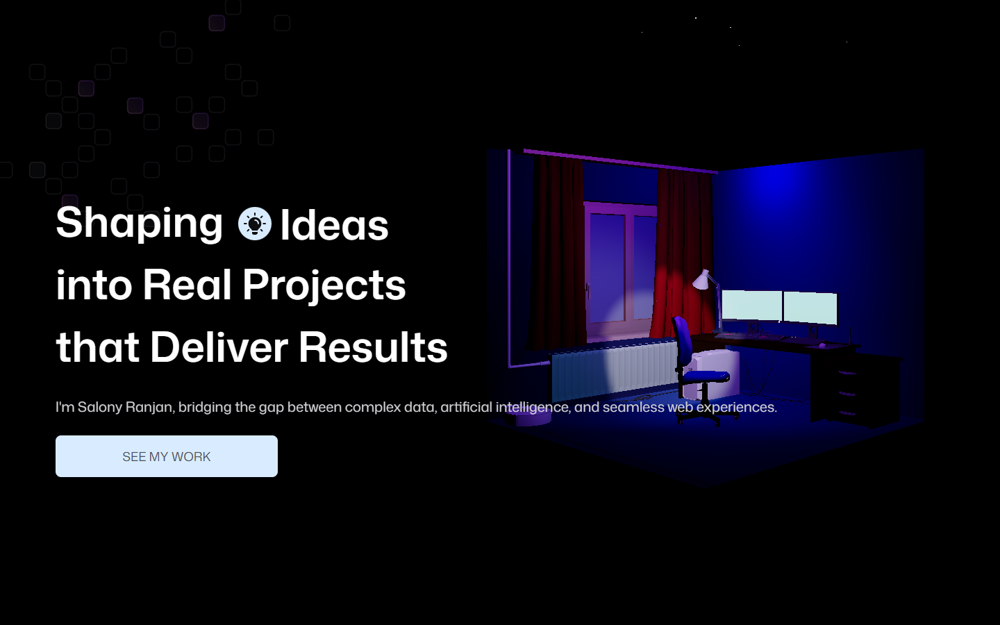
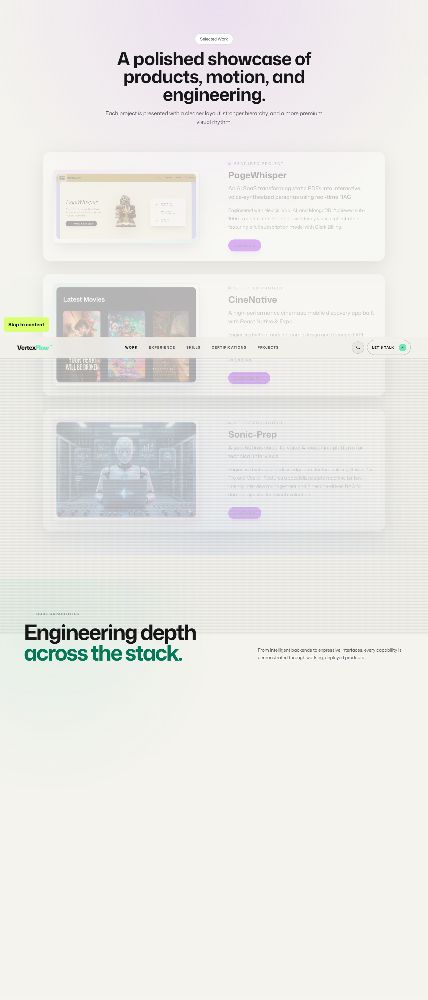
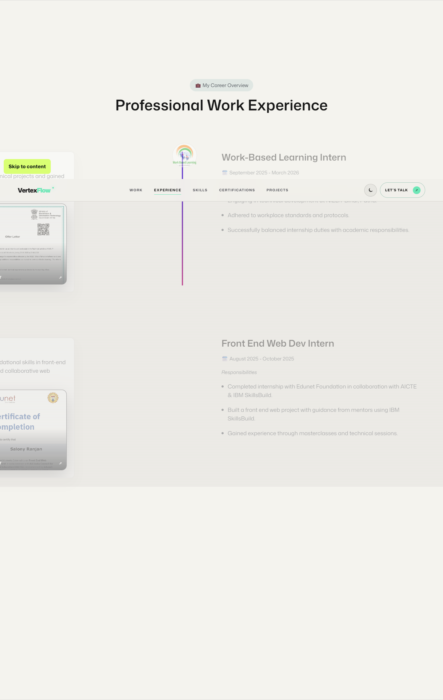
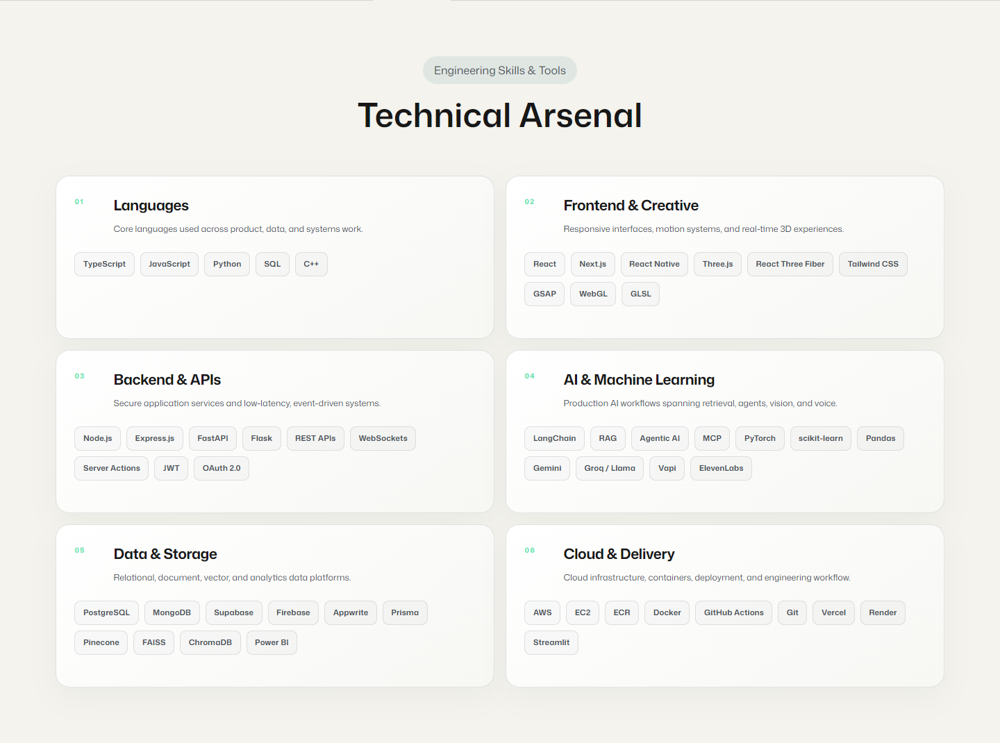
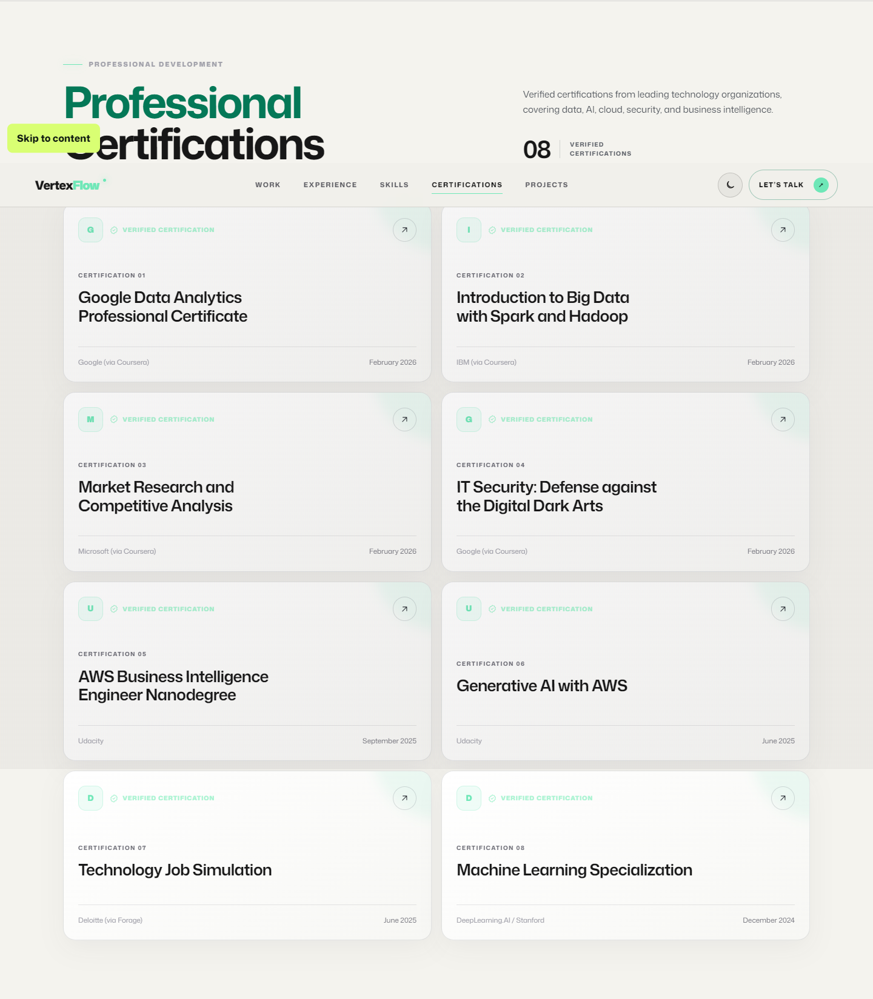
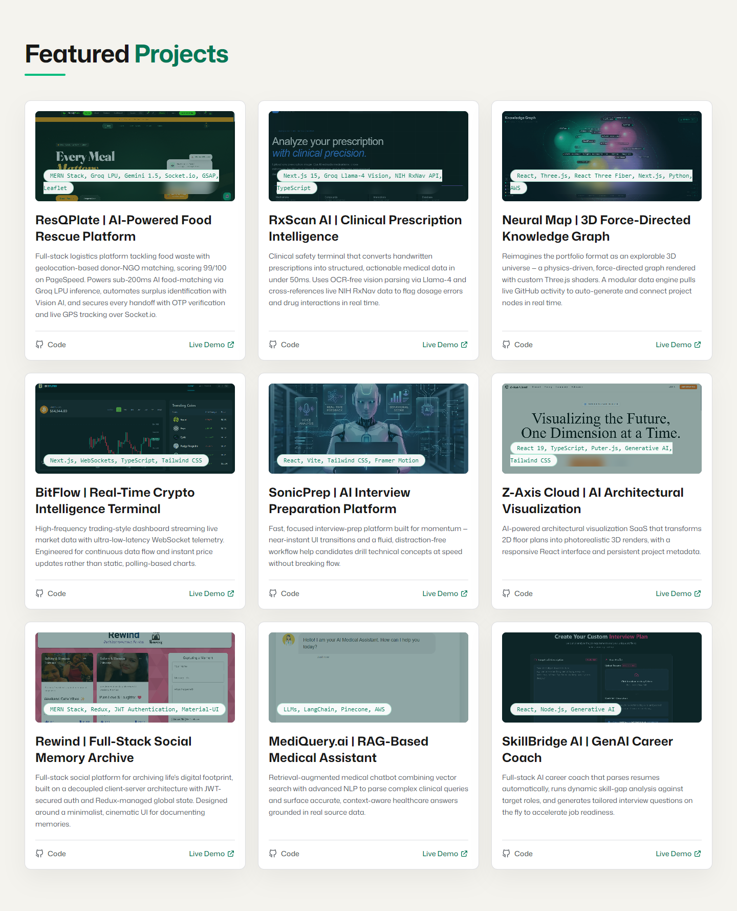
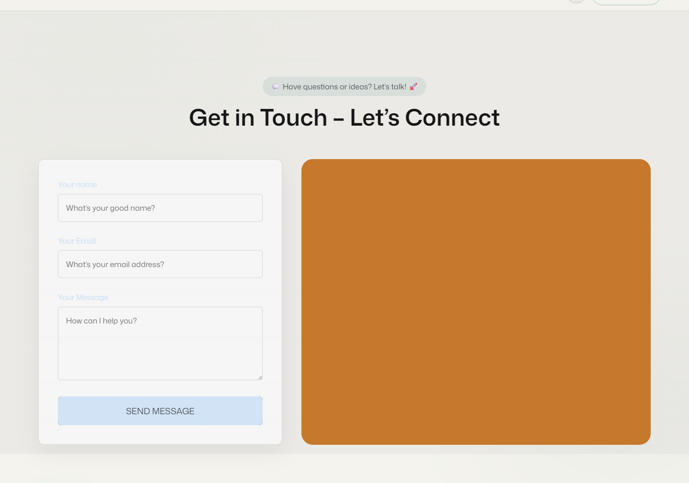

<div align="center">


# VertexFlow

### Engineering ideas into immersive digital experiences

VertexFlow is the interactive developer portfolio of **Salony Ranjan**, combining full-stack engineering, artificial intelligence, 3D graphics, and thoughtful interaction design.

[](https://react.dev/)
[](https://vite.dev/)
[](https://threejs.org/)
[](https://gsap.com/)

[**Open the live portfolio**](https://vertex-flow-phi.vercel.app/) · [Visual showcase](#visual-showcase) · [Highlights](#highlights) · [Run locally](#run-locally)

</div>

---

## About VertexFlow

VertexFlow presents Salony's work, experience, skills, certifications, and projects through a responsive, motion-rich interface. A Three.js hero, carefully paced GSAP animations, and persistent theme preferences create a cinematic experience without sacrificing usability.

---

## Visual showcase

The screenshots below capture every major section in light mode at a consistent desktop width for a clear, uninterrupted preview.

### Hero



### About Me


### Selected Work and Capabilities



### Professional Experience



### Skills and Tools



### Certifications



### Featured Projects



### Contact



---

## Highlights

- Responsive desktop and mobile layouts
- Interactive React Three Fiber hero environment
- Smooth GSAP-driven scroll animations
- Persistent light and dark themes
- Selected-work and featured-project showcases
- Expandable professional experience documents
- Accessible keyboard navigation and reduced-motion support
- Contact form powered by EmailJS

---

## Technology stack

| Area | Technology |
| --- | --- |
| Frontend | React 19, Vite 8 |
| Styling | Tailwind CSS 4, responsive custom styles |
| 3D | Three.js, React Three Fiber, React Three Drei |
| Motion | GSAP, GSAP React |
| Contact | EmailJS |
| Quality | ESLint, production build verification |

---

## Project structure

```text
VertexFlow/
├── public/
│   ├── images/                  Portfolio and 3D visual assets
│   └── screenshots/             README showcase captures
├── src/
│   ├── components/              Navigation, controls, and 3D experiences
│   ├── constants/               Portfolio content and project data
│   ├── sections/                Page sections and feature showcases
│   ├── App.jsx                  Application composition
│   ├── index.css                Theme and responsive styling
│   └── main.jsx                 React entry point
├── .env.example                 Contact configuration template
├── package.json                 Commands and dependencies
└── vite.config.js               Vite and Tailwind configuration
```

---

## Run locally

### Requirements

- Node.js 20.19+ or 22.12+
- npm
- Optional EmailJS account for contact-form delivery

### Installation

```bash
git clone https://github.com/salonyranjan/VertexFlow.git
cd VertexFlow
npm install
npm run dev
```

Open the local address printed by Vite.

For contact-form delivery, copy `.env.example` to `.env` and add your EmailJS credentials. Keep private credentials out of source control.

---

## Quality checks

```bash
npm run lint
npm run build
npm run check
npm test
npm run preview
```

| Command | Purpose |
| --- | --- |
| `npm run lint` | Checks the source with ESLint |
| `npm run build` | Creates the optimized production build |
| `npm run check` | Runs linting and the production build together |
| `npm test` | Runs linting, builds the site, and executes desktop and mobile browser checks |
| `npm run preview` | Serves the production build locally |

Install Playwright's Chromium browser once with `npx playwright install chromium` before running the browser checks locally.

---

## Author

Developed by **Salony Ranjan** — Full-Stack and AI Engineer.

[Portfolio](https://vertex-flow-phi.vercel.app/) · [GitHub](https://github.com/salonyranjan) · [LinkedIn](https://www.linkedin.com/in/salony-ranjan-b63200280/)

> This is a personal portfolio. Please do not reuse personal images or content without permission.

<div align="center">

**Built where engineering, intelligence, and interaction meet.**

</div>
