<div align="center">

<!-- ═══════════════════════════════════════════════════════════════ -->
<!--                       HERO BANNER                             -->
<!-- ═══════════════════════════════════════════════════════════════ -->


<br/>

<!-- ── Hero Image ── -->
<a href="https://vertex-flow-phi.vercel.app/">
  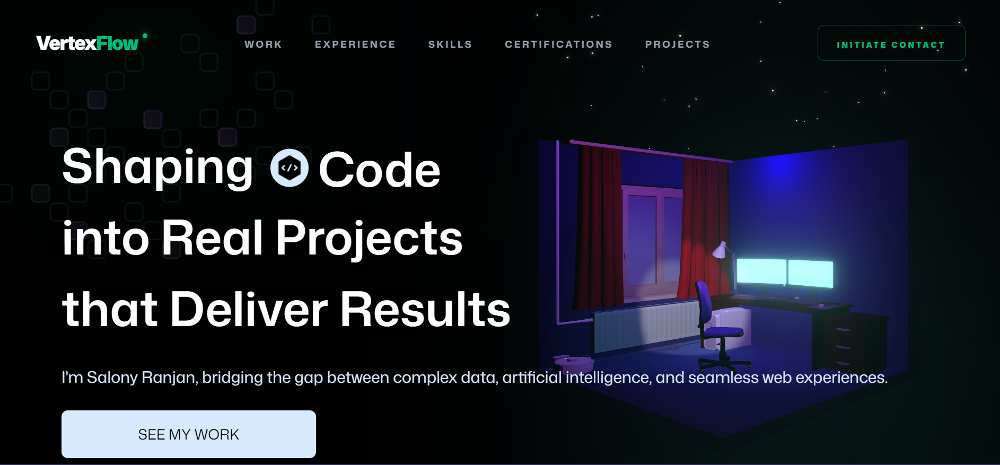
</a>

<br/><br/>


<br/><br/>

<!-- ── Tech Badges ── -->


<br/>


<br/>

<!-- ── Social Badges ── -->


<br/><br/>

> *"A high-performance 3D developer portfolio — where cinematic WebGL rendering meets fluid animation engineering."*

<br/>

<a href="https://vertex-flow-phi.vercel.app/"></a>
&nbsp;
<a href="#11--running-locally"></a>
&nbsp;
<a href="#4--key-features"></a>
&nbsp;
<a href="#9--featured-engineering-projects"></a>

</div>

---

## 📋 Table of Contents

1. [🌌 Welcome](#1--welcome)
2. [🖼️ Visual Experience](#2-%EF%B8%8F-visual-experience)
3. [📊 Portfolio at a Glance](#3--portfolio-at-a-glance)
4. [✨ Key Features](#4--key-features)
   - 4.1 [🎬 Cinematic 3D Experience](#41--cinematic-3d-experience)
   - 4.2 [🌊 Fluid Motion & Orchestration](#42--fluid-motion--orchestration)
   - 4.3 [⚙️ Modern Engineering Stack](#43-%EF%B8%8F-modern-engineering-stack)
5. [🏗️ Feature Orchestration Architecture](#5-%EF%B8%8F-feature-orchestration-architecture)
6. [🔄 Architecture & Interaction Flow](#6--architecture--interaction-flow)
   - 6.1 [🔀 The Interaction Flow](#61--the-interaction-flow)
   - 6.2 [📐 Technical Stack Hierarchy](#62--technical-stack-hierarchy)
   - 6.3 [🔗 Feature Relationship (ERD Style)](#63--feature-relationship-erd-style)
   - 6.4 [🗃️ Conceptual Data Model](#64-%EF%B8%8F-conceptual-data-model)
7. [🗺️ 3D System Map](#7-%EF%B8%8F-3d-system-map)
8. [🛠️ Tech Stack](#8-%EF%B8%8F-tech-stack)
   - 8.1 [🎨 3D & Creative Engineering](#81--3d--creative-engineering)
   - 8.2 [⚛️ Frontend & Styling](#82-%EF%B8%8F-frontend--styling)
   - 8.3 [🔌 Integrations & DevOps](#83--integrations--devops)
9. [🚀 Featured Engineering Projects](#9--featured-engineering-projects)
   - 9.1 [🤖 AI & Agentic Systems](#91--ai--agentic-systems)
   - 9.2 [🌐 Full-Stack & Cloud](#92--full-stack--cloud)
   - 9.3 [⚡ Performance & Scalability](#93--performance--scalability)
10. [🧠 Technical Domain Expertise](#10--technical-domain-expertise)
11. [📦 Running Locally](#11--running-locally)
    - 11.1 [🔧 Prerequisites](#111--prerequisites)
    - 11.2 [⬇️ Clone & Install](#112-%EF%B8%8F-clone--install)
    - 11.3 [🔑 Environment Variables](#113--environment-variables)
    - 11.4 [🖥️ Run & Build](#114-%EF%B8%8F-run--build)
12. [🚢 Deployment](#12--deployment)
13. [👤 Author](#13--author)
14. [⭐ Show Your Support](#14--show-your-support)

---

## 1. 🌌 Welcome

Welcome to **VertexFlow** — my personal developer portfolio engineered as a fully immersive, 3D-powered web experience. Built at the intersection of **WebGL graphics**, **cinematic animation**, and **modern React architecture**, VertexFlow is not just a portfolio — it's a high-performance 3D engine that showcases my journey as a Full-Stack and AI/ML Developer through immersive visual storytelling.

🔗 **[View Live Portfolio →](https://vertex-flow-phi.vercel.app/)**

| 🔖 | Version | 📦 Highlight |
|:---:|:---:|:---|
| 🆕 | `v2.0` | Post-processing bloom · Motion blur · Responsive camera FOV |
| 🔄 | `v1.5` | GSAP ScrollTrigger timelines · Lenis smooth-scroll physics · Drei optimizations |
| 🎉 | `v1.0` | Three.js WebGL hero · React Three Fiber · Framer Motion UI · EmailJS contact |

---

## 2. 🖼️ Visual Experience

VertexFlow is engineered to bridge the gap between high-end 3D graphics and functional web interfaces. The experience is centred around fluid motion, spatial depth, and visual storytelling.

<div align="center">


### 🌌 Immersive Hero Scene


> ⚡ Real-time **WebGL environment** built with Three.js and custom shaders · Dynamic geometry reacts to scroll position · Motion blur post-processing at 60 FPS

<br/>

### 🚀 Project Showcase — *Interactive 3D Cards*

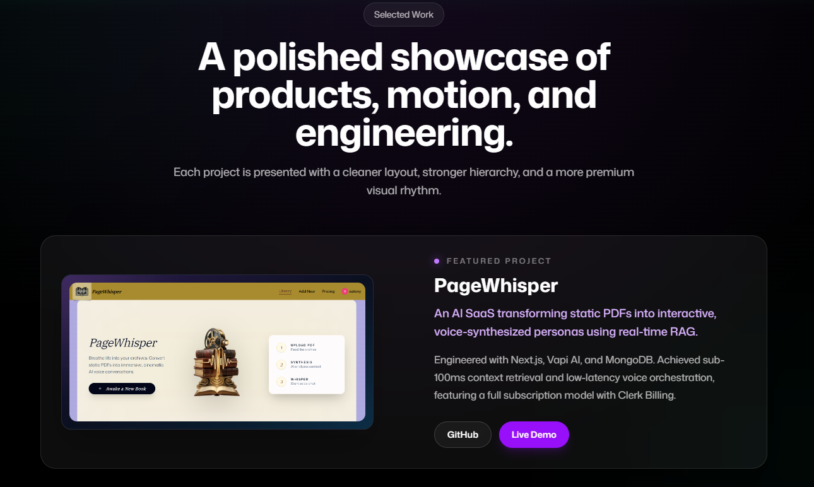
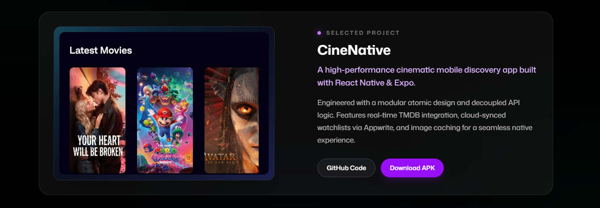
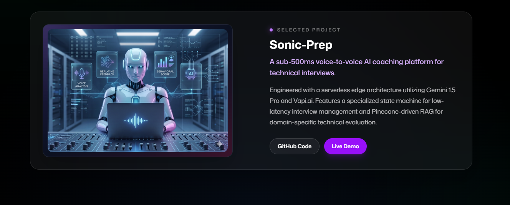

> 🃏 **3D tilt cards** respond to hover with parallax depth · GSAP-driven stagger reveals on scroll · Each project links to live demos and source repos

<br/>

### ✨ Animated Tech Stack — *Scroll-Revealed Mastery*

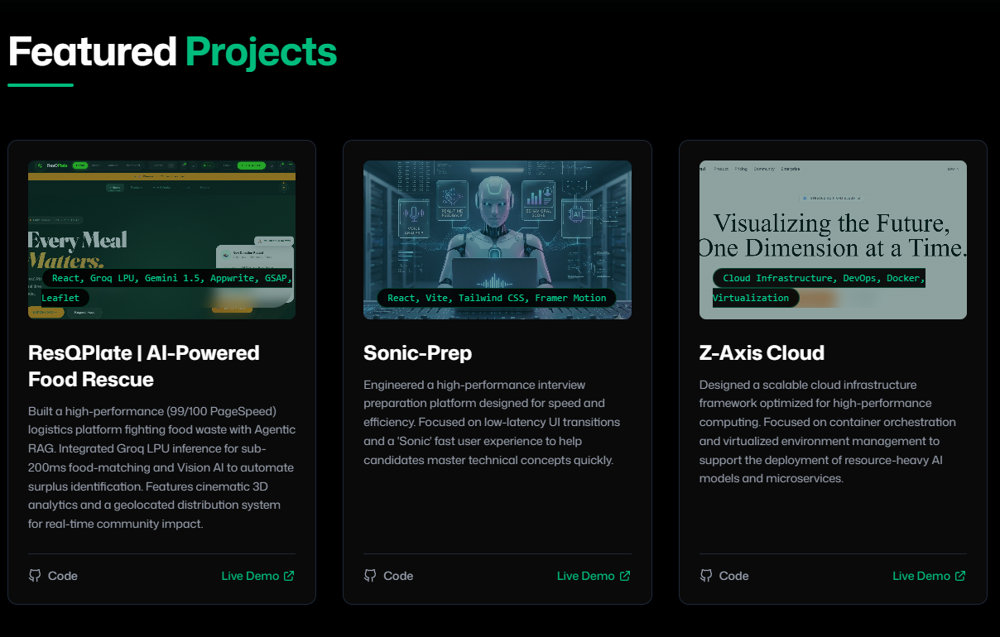
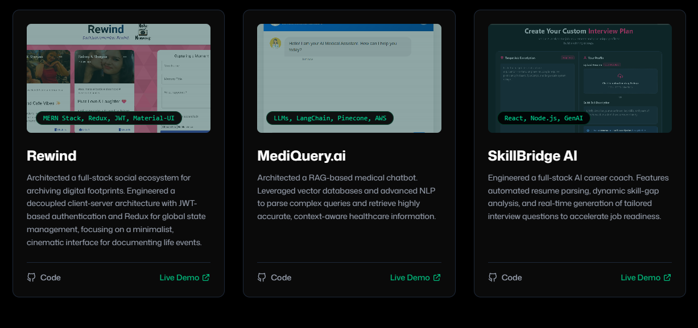
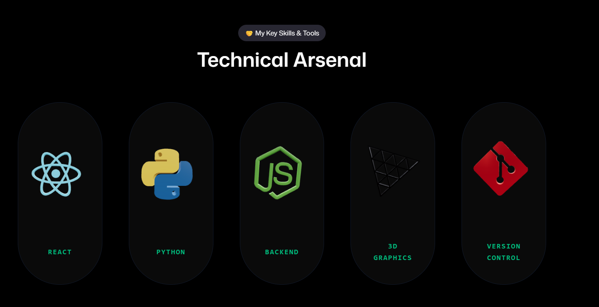

> 🎞️ **GSAP-orchestrated timelines** reveal technical proficiency on scroll · Spring-based icon animations via Framer Motion · Skill categories grouped by domain

<br/>

### ✉️ Cinematic Contact — *Glassmorphic UI*

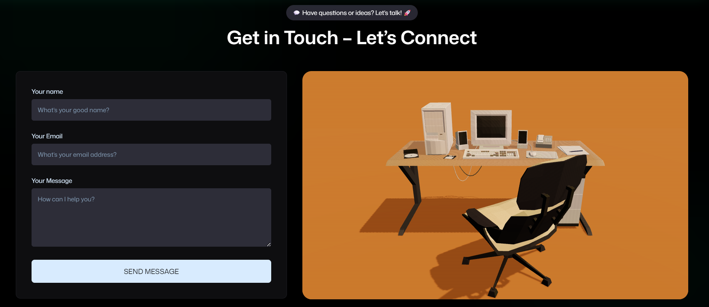

> 💎 **Glassmorphic UI design** with backdrop blur and semi-transparent layers · EmailJS serverless integration · Optimised for high-conversion and sleek micro-interactions

</div>

<div align="center">

| 🖥️ Section | 📱 Mobile | 💻 Tablet | 🖥️ Desktop |
|:---|:---:|:---:|:---:|
| 🌌 Hero Scene | ✅ | ✅ | ✅ |
| 🚀 Projects | ✅ | ✅ | ✅ |
| ✨ Tech Stack | ✅ | ✅ | ✅ |
| 📖 Experience | ✅ | ✅ | ✅ |
| ✉️ Contact | ✅ | ✅ | ✅ |

</div>

---

## 3. 📊 Portfolio at a Glance

<div align="center">

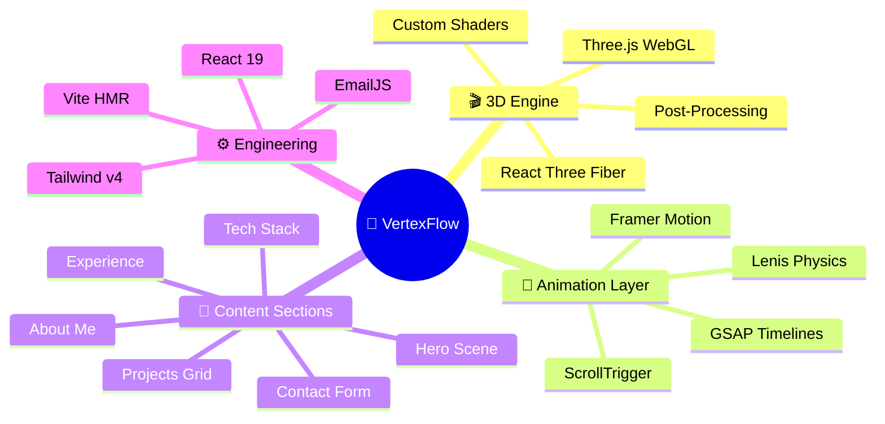
```mermaid
mindmap
  root((🌌 VertexFlow))
    🎬 3D Engine
      Three.js WebGL
      React Three Fiber
      Custom Shaders
      Post-Processing
    🌊 Animation Layer
      GSAP Timelines
      ScrollTrigger
      Lenis Physics
      Framer Motion
    🚀 Content Sections
      Hero Scene
      About Me
      Projects Grid
      Tech Stack
      Experience
      Contact Form
    ⚙️ Engineering
      React 19
      Vite HMR
      Tailwind v4
      EmailJS
```

</div>

| 🔢 Metric | 🎯 Value | 📝 Notes |
|:---|:---:|:---|
| 🎯 **Frame Rate** | `60 FPS` | Hardware-accelerated WebGL rendering |
| 🎨 **3D Library** | `Three.js + R3F` | React Three Fiber declarative scene graph |
| ⚡ **Scroll Engine** | `Lenis` | Eliminates scroll jank, native-app feel |
| 🎞️ **Animation** | `GSAP + Framer` | Dual-layer motion orchestration |
| 🏗️ **Build Tool** | `Vite` | Near-instant Hot Module Replacement |
| 📦 **Sections** | `6+` | Hero · About · Projects · Stack · XP · Contact |
| 🧩 **Tech Domains** | `4` | AI/ML · Full-Stack · Cloud · Performance |

---

## 4. ✨ Key Features

VertexFlow isn't just a portfolio — it's a high-performance 3D engine designed to showcase technical depth through immersive visual storytelling.

### 4.1 🎬 Cinematic 3D Experience

<table>
  <tr><td>🌐</td><td><strong>Immersive WebGL Environments</strong></td><td>Built with <strong>Three.js</strong> and <strong>React Three Fiber (R3F)</strong> for high-fidelity real-time rendering directly in the browser</td></tr>
  <tr><td>🔮</td><td><strong>Dynamic 3D Geometry</strong></td><td>Optimised 3D model orchestration with <strong>@react-three/drei</strong>, ensuring fast load times without sacrificing visual quality</td></tr>
  <tr><td>🌟</td><td><strong>Post-Processing Effects</strong></td><td>Custom <strong>motion blur and bloom</strong> effects to enhance the cinematic quality of 3D renders</td></tr>
  <tr><td>📷</td><td><strong>Responsive Camera</strong></td><td>Dynamically adjusted <strong>Field of View (FOV)</strong> to ensure the 3D scene looks perfect on both mobile and ultra-wide displays</td></tr>
  <tr><td>🎭</td><td><strong>Glassmorphic UI Overlay</strong></td><td>Backdrop blurs and semi-transparent layers create a modern, futuristic aesthetic on top of the 3D canvas</td></tr>
</table>

### 4.2 🌊 Fluid Motion & Orchestration

<table>
  <tr><td>📜</td><td><strong>Smooth Scroll Physics</strong></td><td>Integrated <strong>Lenis</strong> smooth-scrolling to eliminate "scroll jank" and provide a native-app feel throughout the entire experience</td></tr>
  <tr><td>🎞️</td><td><strong>Scroll-Triggered Timelines</strong></td><td>Complex animation sequences orchestrated via <strong>GSAP (GreenSock) ScrollTrigger</strong> that stay perfectly in sync with user movement</td></tr>
  <tr><td>💫</td><td><strong>UI Micro-interactions</strong></td><td>Declarative, spring-based animations using <strong>Framer Motion</strong> for polished interface feedback and hover states</td></tr>
  <tr><td>🃏</td><td><strong>3D Card Tilt Effects</strong></td><td>Project cards respond to pointer position with real-time perspective transforms — parallax depth without a library</td></tr>
</table>

### 4.3 ⚙️ Modern Engineering Stack

<table>
  <tr><td>⚡</td><td><strong>Next-Gen Tooling</strong></td><td>Built on <strong>Vite</strong> and <strong>React 19</strong> for near-instant Hot Module Replacement (HMR) and concurrent rendering features</td></tr>
  <tr><td>🎨</td><td><strong>Utility-First Styling</strong></td><td>Leveraging <strong>Tailwind CSS v4</strong> for a streamlined, high-performance design system with zero runtime overhead</td></tr>
  <tr><td>📧</td><td><strong>Serverless Contact</strong></td><td>A robust contact system powered by <strong>EmailJS</strong> for seamless client-side email delivery — no backend required</td></tr>
  <tr><td>🚀</td><td><strong>Edge Deployment</strong></td><td>Globally distributed via <strong>Vercel</strong> with automatic CI/CD pipeline on every push to main</td></tr>
</table>

---

## 5. 🏗️ Feature Orchestration Architecture

The diagram below illustrates how the technical components of VertexFlow interact to create the **"Cinematic Flow"** — from a user's scroll gesture to a rendered frame on screen.

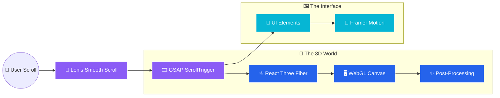
```mermaid
graph LR
    %% Styles
    classDef engine fill:#2563eb,color:#fff,stroke:#fff
    classDef motion fill:#8b5cf6,color:#fff,stroke:#fff
    classDef ui fill:#06b6d4,color:#fff,stroke:#fff

    %% Flow
    User((👤 User Scroll)) --> Lenis[🌊 Lenis Smooth Scroll]
    Lenis --> GSAP[🎞️ GSAP ScrollTrigger]

    subgraph "🌌 The 3D World"
    GSAP --> R3F[⚛️ React Three Fiber]
    R3F --> Canvas[🖥️ WebGL Canvas]
    Canvas --> PostFX[✨ Post-Processing]
    end

    subgraph "🖼️ The Interface"
    GSAP --> DOM[📄 UI Elements]
    DOM --> Framer[💫 Framer Motion]
    end

    class R3F,Canvas,PostFX engine
    class Lenis,GSAP motion
    class DOM,Framer ui
```

---

## 6. 🔄 Architecture & Interaction Flow

### 6.1 🔀 The Interaction Flow

This diagram shows how the user's gestures propagate through both the 3D rendering layer and the UI interface layer simultaneously.

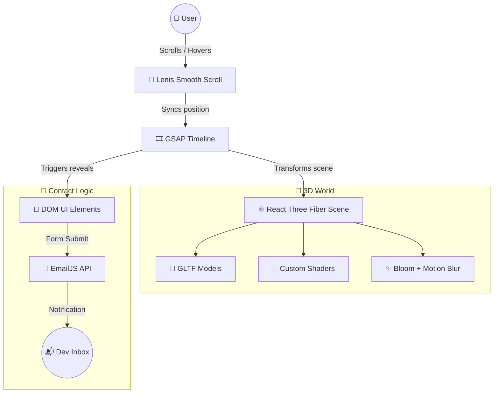
```mermaid
graph TD
    User((👤 User)) -->|Scrolls / Hovers| Lenis[🌊 Lenis Smooth Scroll]
    Lenis -->|Syncs position| GSAP[🎞️ GSAP Timeline]
    GSAP -->|Transforms scene| R3F[⚛️ React Three Fiber Scene]
    GSAP -->|Triggers reveals| UI[📄 DOM UI Elements]

    subgraph "🌌 3D World"
    R3F --> Models[🔮 GLTF Models]
    R3F --> Shaders[🌟 Custom Shaders]
    R3F --> PostFX[✨ Bloom + Motion Blur]
    end

    subgraph "📨 Contact Logic"
    UI -->|Form Submit| EmailJS[📧 EmailJS API]
    EmailJS -->|Notification| Inbox((📬 Dev Inbox))
    end
```

### 6.2 📐 Technical Stack Hierarchy

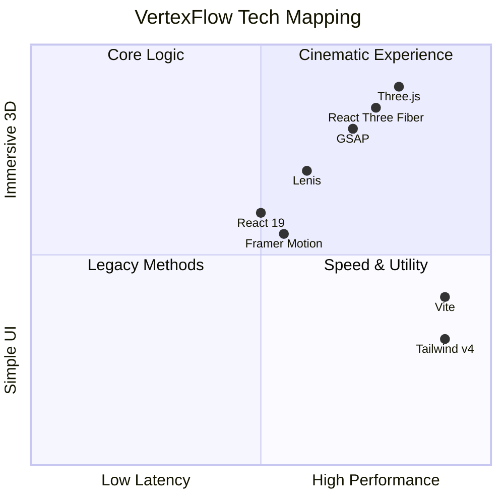
```mermaid
quadrantChart
    title VertexFlow Tech Mapping
    x-axis Low Latency --> High Performance
    y-axis Simple UI --> Immersive 3D
    quadrant-1 "Cinematic Experience"
    quadrant-2 "Core Logic"
    quadrant-3 "Legacy Methods"
    quadrant-4 "Speed & Utility"
    "Three.js": [0.8, 0.9]
    "React Three Fiber": [0.75, 0.85]
    "GSAP": [0.7, 0.8]
    "React 19": [0.5, 0.6]
    "Lenis": [0.6, 0.7]
    "Framer Motion": [0.55, 0.55]
    "Vite": [0.9, 0.4]
    "Tailwind v4": [0.9, 0.3]
```

### 6.3 🔗 Feature Relationship (ERD Style)

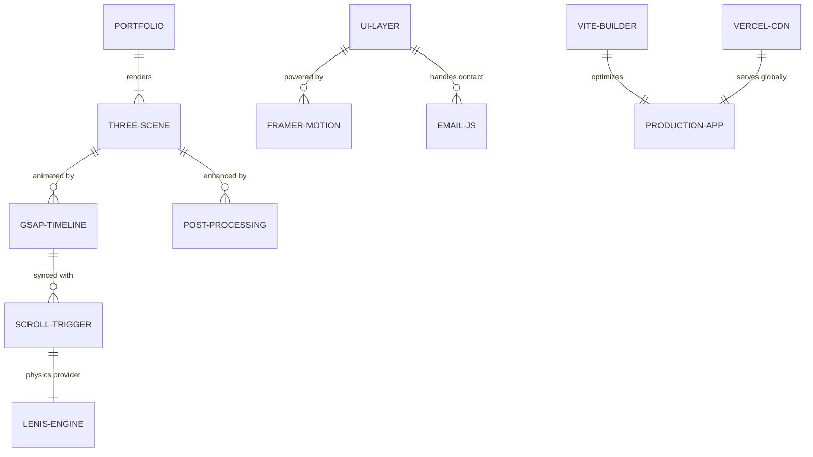
```mermaid
erDiagram
    PORTFOLIO ||--|{ THREE-SCENE : "renders"
    THREE-SCENE ||--o{ GSAP-TIMELINE : "animated by"
    GSAP-TIMELINE ||--o{ SCROLL-TRIGGER : "synced with"
    SCROLL-TRIGGER ||--|| LENIS-ENGINE : "physics provider"
    THREE-SCENE ||--o{ POST-PROCESSING : "enhanced by"

    UI-LAYER ||--o{ FRAMER-MOTION : "powered by"
    UI-LAYER ||--o{ EMAIL-JS : "handles contact"
    VITE-BUILDER ||--|| PRODUCTION-APP : "optimizes"
    VERCEL-CDN ||--|| PRODUCTION-APP : "serves globally"
```

### 6.4 🗃️ Conceptual Data Model

Although VertexFlow is a serverless frontend application, the UI is driven by a strictly typed data model, and user interactions are handled via structured payloads to external APIs.

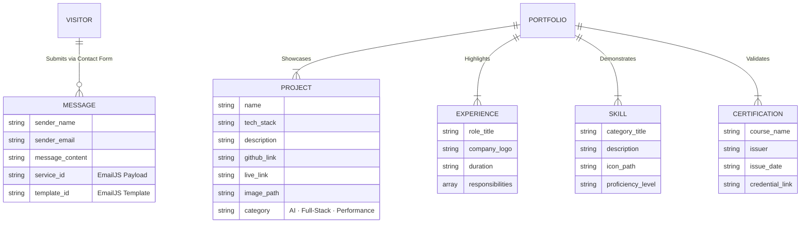
```mermaid
erDiagram
    VISITOR ||--o{ MESSAGE : "Submits via Contact Form"
    PORTFOLIO ||--|{ PROJECT : "Showcases"
    PORTFOLIO ||--|{ EXPERIENCE : "Highlights"
    PORTFOLIO ||--|{ SKILL : "Demonstrates"
    PORTFOLIO ||--|{ CERTIFICATION : "Validates"

    MESSAGE {
        string sender_name
        string sender_email
        string message_content
        string service_id "EmailJS Payload"
        string template_id "EmailJS Template"
    }

    PROJECT {
        string name
        string tech_stack
        string description
        string github_link
        string live_link
        string image_path
        string category "AI · Full-Stack · Performance"
    }

    EXPERIENCE {
        string role_title
        string company_logo
        string duration
        array responsibilities
    }

    SKILL {
        string category_title
        string description
        string icon_path
        string proficiency_level
    }

    CERTIFICATION {
        string course_name
        string issuer
        string issue_date
        string credential_link
    }
```

---

## 7. 🗺️ 3D System Map

```
┌─────────────────────────────────────────────────────────────────────┐
│           🌐 CLIENT LAYER  —  React 19 + Vite 7                     │
│   ┌──────────────────────────────────────────────────────────────┐  │
│   │      Pages  •  Components  •  Hooks  •  Contexts             │  │
│   └──────────────────────────────────────────────────────────────┘  │
└──────────────────────────────┬──────────────────────────────────────┘
                               │
┌──────────────────────────────▼──────────────────────────────────────┐
│         🎞️ ANIMATION LAYER  —  GSAP + Framer Motion + Lenis         │
│   ┌──────────────────────────────────────────────────────────────┐  │
│   │   ScrollTrigger  •  Spring Physics  •  Smooth Scroll Engine  │  │
│   └──────────────────────────────────────────────────────────────┘  │
└──────────────────────────────┬──────────────────────────────────────┘
                               │
┌──────────────────────────────▼──────────────────────────────────────┐
│         🌌 3D RENDERING LAYER  —  Three.js + React Three Fiber      │
│   ┌──────────────────────────────────────────────────────────────┐  │
│   │   WebGL Canvas  •  GLTF Models  •  Custom Shaders  •  Bloom  │  │
│   └──────────────────────────────────────────────────────────────┘  │
└──────────────────────────────┬──────────────────────────────────────┘
                               │
┌──────────────────────────────▼──────────────────────────────────────┐
│         📧 EXTERNAL SERVICES  —  EmailJS + Vercel Edge              │
│   ┌──────────────────────────────────────────────────────────────┐  │
│   │       Serverless Email  •  Global CDN  •  CI/CD Pipeline     │  │
│   └──────────────────────────────────────────────────────────────┘  │
└──────────────────────────────┬──────────────────────────────────────┘
                               │
                               ▼
                   🚀 Deployed Portfolio
           (🌌 Visually Stunning · ⚡ Blazing Fast)
```

| 🏗️ Layer | ⚙️ Technologies | 📝 Responsibility |
|:---|:---|:---|
| 🌐 **Client** | React 19 · Vite · Tailwind v4 | UI rendering, routing, state |
| 🎞️ **Animation** | GSAP · Framer Motion · Lenis | Scroll physics, timelines, micro-interactions |
| 🌌 **3D Rendering** | Three.js · R3F · Drei | WebGL scenes, models, shaders, post-FX |
| 📧 **Services** | EmailJS · Vercel | Serverless email, edge deployment & CDN |

---

## 8. 🛠️ Tech Stack

VertexFlow is built with a modern, performance-first stack focusing on the intersection of 3D graphics and scalable web architecture.

### 8.1 🎨 3D & Creative Engineering

<p>
  
  
  
  
  
</p>

| ⚙️ Technology | 🔬 Usage | 🏆 Result |
|:---|:---|:---|
| **Three.js** | Core WebGL engine for 3D rendering | Real-time GPU-accelerated visuals in browser |
| **React Three Fiber** | Declarative Three.js for React | Composable scene graph with full React lifecycle |
| **@react-three/drei** | Helper abstractions for R3F | Fast-loading 3D models without quality loss |
| **GSAP** | Professional-grade timelines & scroll orchestration | Silky 60 FPS animations perfectly synced to scroll |
| **Framer Motion** | Declarative UI transitions | Spring-based micro-interactions and page reveals |
| **Lenis** | High-performance smooth scroll engine | Native-app feel, zero scroll jank |

### 8.2 ⚛️ Frontend & Styling

<p>
  
  
  
  
</p>

- **React 19** — Utilizing the latest concurrent rendering features for a responsive, non-blocking UI
- **Vite** — Next-generation frontend tooling with near-instant Hot Module Replacement (HMR) and optimised production builds
- **Tailwind CSS v4** — Utility-first styling with the latest CSS engine — zero runtime, maximum performance
- **Lucide React** — Clean, consistent, and lightweight vector icon library

### 8.3 🔌 Integrations & DevOps

<p>
  
  
  
</p>

| ⚙️ Tool | 📝 Purpose |
|:---|:---|
| **EmailJS** | Serverless client-side email integration — no backend required |
| **Vercel** | Globally distributed edge deployment with automatic CI/CD |
| **Git / GitHub** | Version control, branch strategy, and source management |

---

## 9. 🚀 Featured Engineering Projects

VertexFlow serves as the immersive gateway to my technical work, highlighting expertise across AI/ML, Full-Stack Development, and Cloud Infrastructure.

### 9.1 🤖 AI & Agentic Systems

- **[ZenithRAG](https://github.com/salonyranjan/ZenithRAG)** — `Python` `LangChain` `Vector DB` `LLMs`
  > Architected an advanced Level-3 RAG system with a high-throughput pipeline for document parsing and semantic synthesis across large corpora.

- **[RoleRadar](https://github.com/salonyranjan/RoleRadar)** — `AI Agents` `MCP` `Python`
  > Developed an agentic job discovery platform using autonomous AI agents to map candidate profiles to hyper-relevant market opportunities.

- **[MediQuery.ai](https://github.com/salonyranjan/MediQuery.ai)** — `LLMs` `LangChain` `Pinecone` `AWS`
  > Built a RAG-based medical chatbot leveraging vector databases for context-aware healthcare information retrieval.

### 9.2 🌐 Full-Stack & Cloud

- **[Z-Axis Cloud](https://github.com/salonyranjan/Z-Axis-Cloud)** — `Docker` `Cloud Infra` `DevOps`
  > Designed a scalable cloud framework optimised for container orchestration and resource-heavy AI model deployment.

- **[SkillBridge AI](https://github.com/salonyranjan/SkillBridge-AI)** — `React` `Node.js` `GenAI`
  > Engineered an AI career coach featuring automated resume parsing and dynamic skill-gap analysis powered by generative AI.

- **[Rewind](https://github.com/salonyranjan/Rewind)** — `MERN Stack` `Redux` `JWT`
  > Architected a social ecosystem for digital footprints with a decoupled client-server architecture and cinematic UI experience.

### 9.3 ⚡ Performance & Scalability

- **[Sonic-Prep](https://github.com/salonyranjan/sonic-prep)** — `Vite` `Framer Motion`
  > High-performance interview prep platform focused on low-latency UI and sub-100ms interaction response times.

- **[QuickCart](https://github.com/salonyranjan/QuickCart)** — `Next.js` `SSR` `Tailwind`
  > E-commerce architecture fully optimised for Core Web Vitals, SEO, and page speed via server-side rendering.

- **[OpenShelf E2E](https://github.com/salonyranjan/OpenShelf-E2E)** — `ML` `Collaborative Filtering`
  > End-to-end recommendation engine applying collaborative filtering for deeply personalised content discovery.

---

## 10. 🧠 Technical Domain Expertise

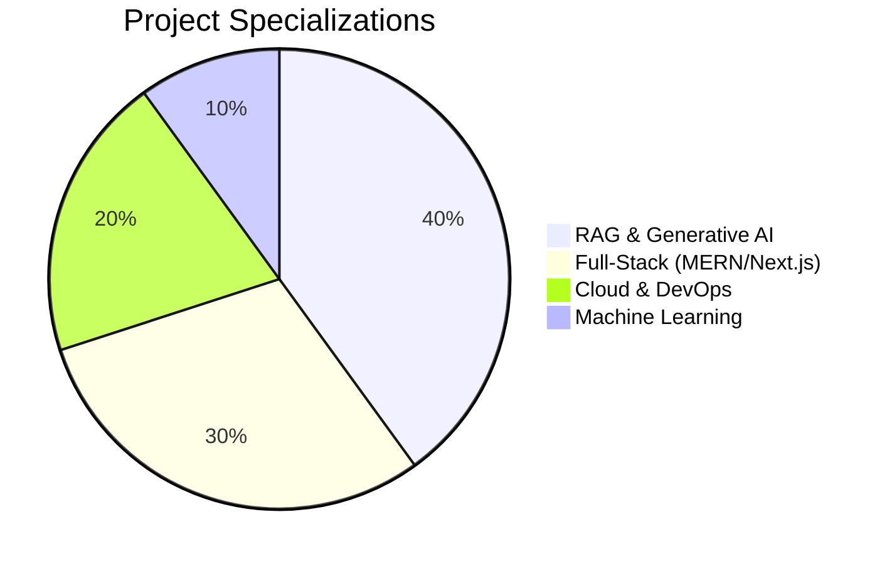
```mermaid
pie title Project Specializations
    "RAG & Generative AI" : 40
    "Full-Stack (MERN/Next.js)" : 30
    "Cloud & DevOps" : 20
    "Machine Learning" : 10
```

| 🧠 Domain | 🔧 Core Technologies | 💡 Focus Area |
|:---|:---|:---|
| 🤖 **RAG & GenAI** | LangChain · Pinecone · LLMs · Python | Agentic pipelines · Vector search · Prompt engineering |
| 🌐 **Full-Stack** | React · Node.js · Next.js · MERN | Scalable SPAs · SSR/SSG · REST APIs |
| ☁️ **Cloud & DevOps** | Docker · AWS · Vercel · CI/CD | Container orchestration · Edge deployment |
| 🌌 **3D & WebGL** | Three.js · R3F · GSAP · Lenis | Cinematic web experiences · Real-time rendering |

---

## 11. 📦 Running Locally

Want to explore the code or run VertexFlow on your own machine? Follow these steps.

### 11.1 🔧 Prerequisites

| 🛠️ Tool | 📌 Version | 🔗 Link |
|:---|:---:|:---|
|  | `≥ 18.x` | [nodejs.org](https://nodejs.org/) |
|  | `≥ 8.x` | Bundled with Node |
| 📧 **EmailJS Account** | Free tier | [emailjs.com](https://www.emailjs.com/) |

### 11.2 ⬇️ Clone & Install

**📥 Step 1 — Clone the repository**

```bash
git clone https://github.com/salonyranjan/VertexFlow.git
cd VertexFlow
```

**📦 Step 2 — Install dependencies**

```bash
npm install
```

### 11.3 🔑 Environment Variables

**🔐 Step 3 — Create `.env` in the root directory**

To make the contact form work locally, add your EmailJS credentials:

```env
# EmailJS Configuration
VITE_APP_EMAILJS_SERVICE_ID=your_service_id_here
VITE_APP_EMAILJS_TEMPLATE_ID=your_template_id_here
VITE_APP_EMAILJS_PUBLIC_KEY=your_public_key_here
```

> 🔐 **Security note:** `.env` is git-ignored. Never commit real keys to your repository. Copy `.env.example` and fill in your values.

### 11.4 🖥️ Run & Build

| 📜 Script | 💻 Command | 📝 Purpose |
|:---|:---|:---|
| 🚀 **Dev server** | `npm run dev` | Start Vite HMR at `http://localhost:5173` |
| 🏗️ **Production build** | `npm run build` | Optimised output in `dist/` |
| 🔍 **Preview build** | `npm run preview` | Test production build locally before deploy |
| 🧹 **Lint** | `npm run lint` | ESLint code quality check |

The application will be available at **http://localhost:5173**.

---

## 12. 🚢 Deployment

VertexFlow is configured for seamless deployment on **Vercel** with zero configuration.

| ⚙️ Setting | 🔧 Value |
|:---|:---|
| **Framework Preset** | Vite |
| **Build Command** | `npm run build` |
| **Output Directory** | `dist` |
| **Node.js Version** | `18.x` |

> **Important:** Ensure `VITE_APP_EMAILJS_SERVICE_ID`, `VITE_APP_EMAILJS_TEMPLATE_ID`, and `VITE_APP_EMAILJS_PUBLIC_KEY` are also configured in your **Vercel Project Settings → Environment Variables** for the live contact form to function correctly.

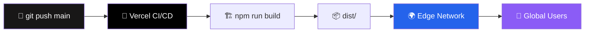
```mermaid
graph LR
    Push[🔀 git push main] --> Vercel[🚀 Vercel CI/CD]
    Vercel --> Build[🏗️ npm run build]
    Build --> Dist[📦 dist/]
    Dist --> Edge[🌍 Edge Network]
    Edge --> User[👤 Global Users]

    style Push fill:#181717,color:#fff
    style Vercel fill:#000,color:#fff
    style Edge fill:#2563eb,color:#fff
    style User fill:#8b5cf6,color:#fff
```

---

## 13. 👤 Author

<table style="border:none;">
  <tr>
    <td align="center" style="border:none;" width="160">
      
    </td>
    <td style="border:none; padding-left:22px;">
      <h3>✦ Salony Ranjan</h3>
      <p>🌌 3D Web Engineer &nbsp;·&nbsp; 🤖 AI/ML Developer &nbsp;·&nbsp; 🚀 Full-Stack Builder</p>
      <p><em>"Bridging the gap between cinematic 3D graphics and intelligent web systems — one vertex at a time."</em></p>
      <br/>
      <a href="https://github.com/salonyranjan"></a>
      &nbsp;
      <a href="https://www.linkedin.com/in/salony-ranjan-b63200280/"></a>
      &nbsp;
      <a href="mailto:salonyranjan@gmail.com"></a>
      &nbsp;
      <a href="https://vertex-flow-phi.vercel.app/"></a>
    </td>
  </tr>
</table>

I am a **Full-Stack Developer and AI Enthusiast** passionate about building immersive digital experiences and autonomous AI agents. I currently focus on the intersection of **3D Web (WebGL)** and **Generative AI (RAG Pipelines)** — designing systems that are as beautiful as they are intelligent.

---

## 14. ⭐ Show Your Support

<div align="center">

If VertexFlow inspired you, taught you something about 3D web engineering, or pushed your creative boundaries — show it some love! 🌌

> 💡 **Pro Tip:** Go to GitHub repo **Settings → Social Preview** and upload the hero screenshot. When you share on LinkedIn, your beautiful WebGL UI shows as the card preview instead of a generic GitHub placeholder — perfect for a portfolio project.

<a href="https://github.com/salonyranjan/VertexFlow/stargazers"></a>
&nbsp;
<a href="https://github.com/salonyranjan/VertexFlow/fork"></a>
&nbsp;
<a href="https://vertex-flow-phi.vercel.app/"></a>

<br/><br/>


<br/>

*Made with* 🌌 *by* [**Salony Ranjan**](https://github.com/salonyranjan) &nbsp;·&nbsp; *© 2026 VertexFlow · MIT*


</div>
