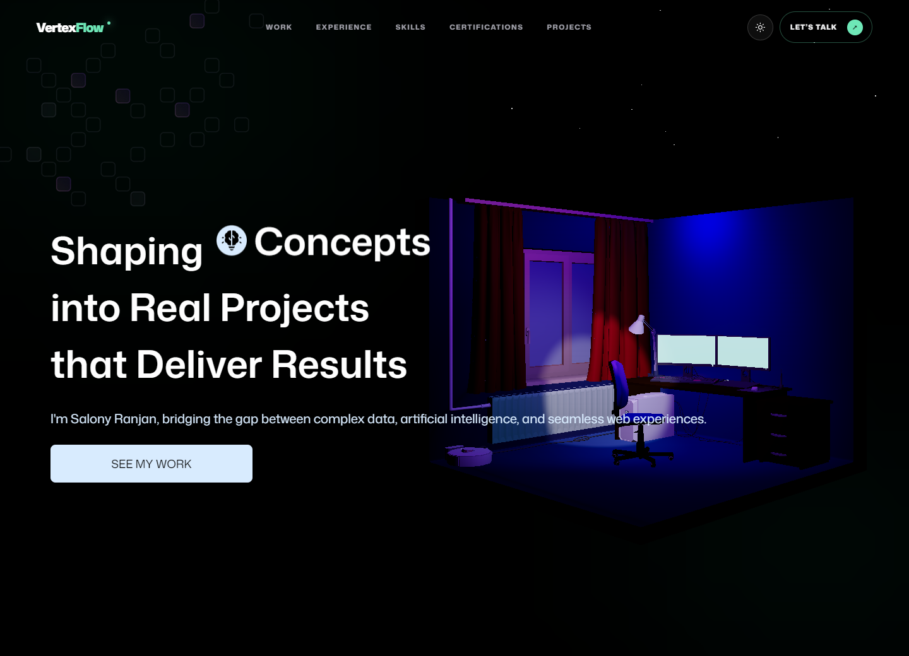
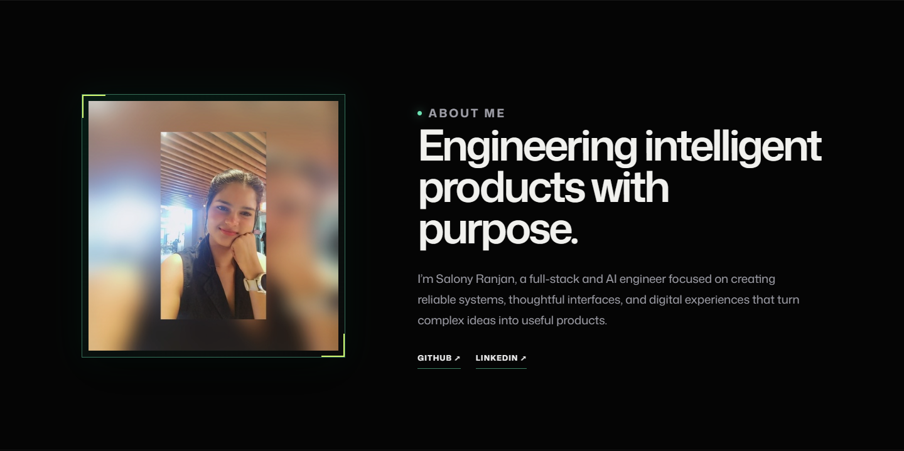
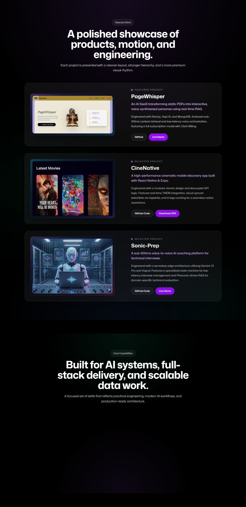
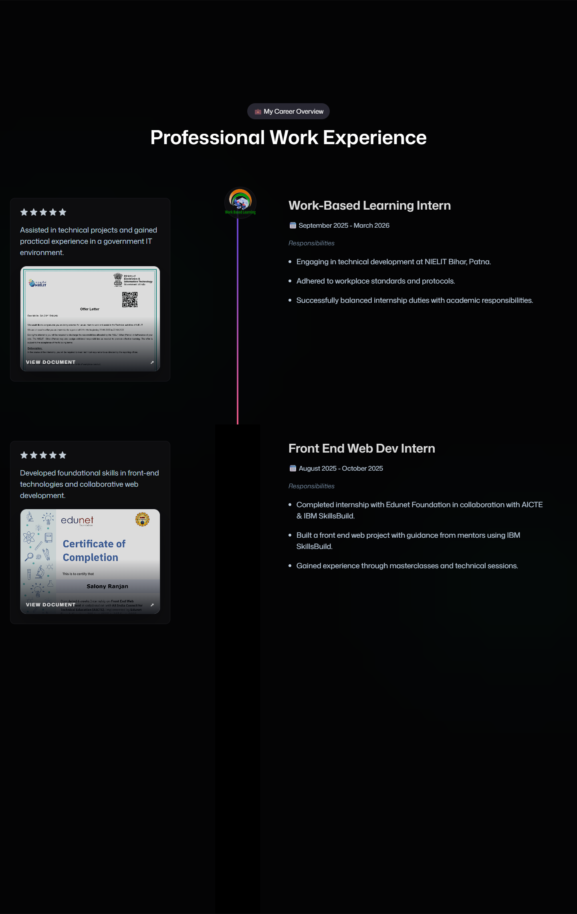
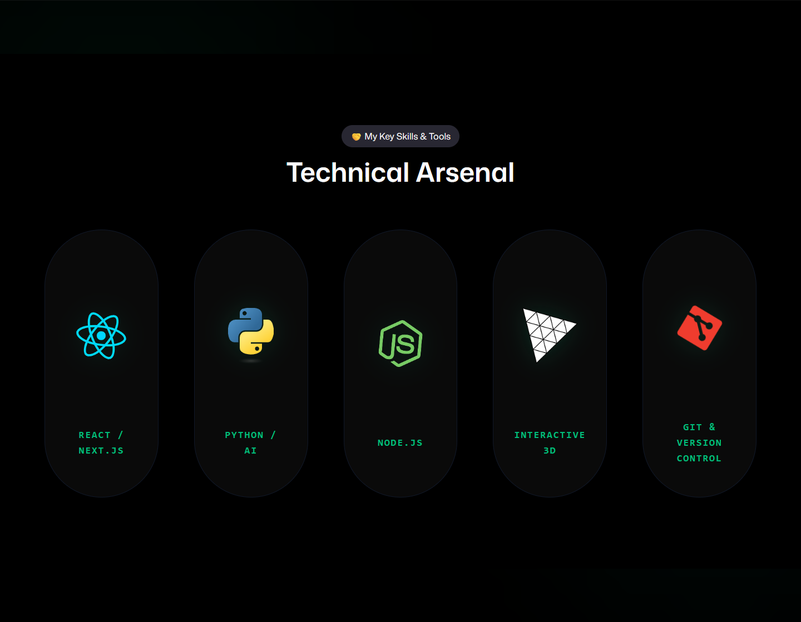
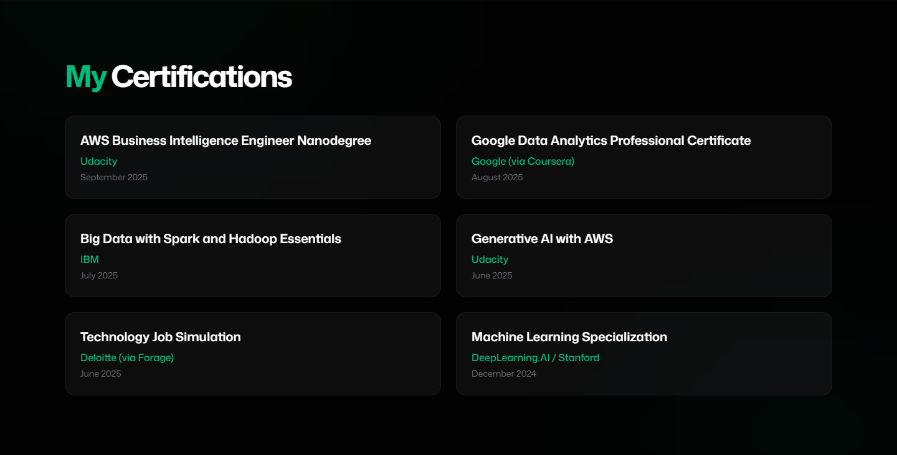
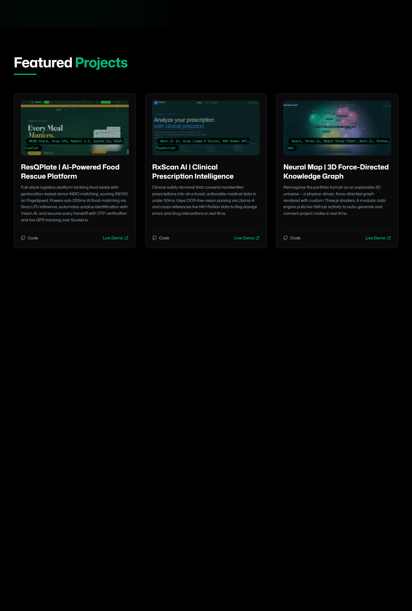
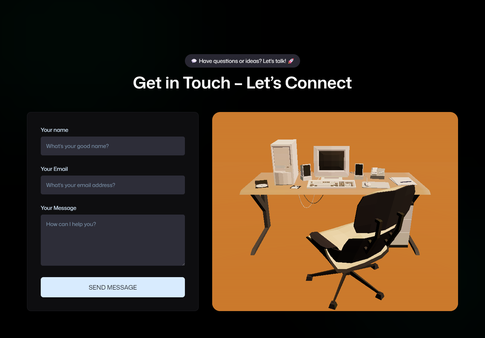
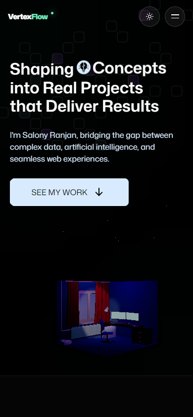

# VertexFlow

An immersive developer portfolio for **Salony Ranjan**, bringing together full-stack engineering, AI, 3D graphics, and polished interaction design.

## Visual tour

### Hero



| About | Selected work |
| --- | --- |
|  |  |

| Experience | Skills |
| --- | --- |
|  |  |

| Certifications | Projects |
| --- | --- |
|  |  |

| Contact | Mobile experience |
| --- | --- |
|  |  |

## Highlights

- Responsive desktop and mobile layouts
- Interactive Three.js hero environment
- Smooth GSAP scroll animations
- Light and dark themes
- Expandable experience documents
- Accessible keyboard and reduced-motion support

## Tech stack

React 19 · Vite · Tailwind CSS · Three.js · React Three Fiber · GSAP · EmailJS

## Run locally

```bash
git clone https://github.com/salonyranjan/VertexFlow.git
cd VertexFlow
npm install
npm run dev
```

For the contact form, copy `.env.example` to `.env` and add your EmailJS credentials.

```bash
npm run check     # lint and production build
npm run preview   # preview the production build
```

## Author

**Salony Ranjan** — Full-Stack and AI Engineer

[Portfolio](https://vertex-flow-phi.vercel.app/) · [GitHub](https://github.com/salonyranjan) · [LinkedIn](https://www.linkedin.com/in/salony-ranjan-b63200280/)

Personal portfolio. Please do not reuse personal images or content without permission.
